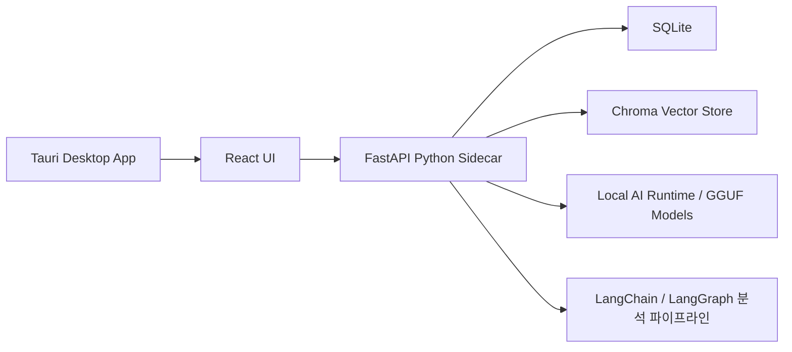

# Story Guard

Story Guard는 웹소설, 장편 소설, 드라마 시나리오처럼 설정과 관계가 길게 누적되는 작품을 위한 로컬 우선 데스크톱 앱입니다. 작가의 원고를 로컬에서 분석해 인물, 장소, 조직, 아이템, 사건, 규칙, 떡밥의 관계를 그래프로 보여주고, 설정 충돌이나 미회수 떡밥 후보를 리포트로 정리합니다.

클라우드 LLM 호출을 기본으로 넣지 않았고, 원고와 분석 데이터는 사용자 컴퓨터 안에 저장됩니다.

## 주요 기능

- `txt`, `md`, `docx` 원고 파일 가져오기
- 한국어 원고 기반 엔티티 추출
- 인물, 장소, 조직, 아이템, 사건, 규칙, 떡밥 그래프 시각화
- 조직을 큰 집합 영역으로 보고 소속 인물, 장소, 사건, 규칙을 내부에 배치하는 그래프 보기
- 핵심 관계/전체 관계 보기 전환
- 설정 충돌, 시간선 오류, 미회수 떡밥 후보 리포트
- 이슈 상태 관리: 열림, 확정, 무시, 보류
- 앱 관리 로컬 LLM 설치와 분석
- LangChain 기반 chunking/RAG 색인
- LangGraph 스타일 분석 파이프라인
- SQLite와 Chroma를 이용한 로컬 저장

## 기술 스택

- 데스크톱: Tauri v2
- 프론트엔드: React, TypeScript, Vite, Cytoscape
- 백엔드: Python, FastAPI
- 데이터 저장: SQLite, Chroma
- 로컬 AI: llama.cpp, GGUF 로컬 모델, LangChain, LangGraph
- 패키징: PyInstaller sidecar, Tauri bundle

## 동작 구조



분석 흐름은 대략 다음 순서로 진행됩니다.


## 보안과 프라이버시

- 원고 본문, chunk, 엔티티, 관계, 이슈는 로컬 앱 데이터 디렉터리에 저장됩니다.
- 분석은 앱 데이터 디렉터리에 설치된 로컬 GGUF 모델로만 동작합니다.
- 모델이 없으면 분석을 실행하지 않고, 환경 설정에서 로컬 LLM 설치가 필요하다고 표시합니다.
- 외부 클라우드 LLM 호출 코드는 기본 경로에 없습니다.
- 데스크톱 앱은 FastAPI sidecar를 `127.0.0.1`에만 바인딩합니다.
- 데스크톱 실행 시 Tauri가 로컬 API 토큰을 앱 데이터 디렉터리에 저장하고, sidecar API 요청에 토큰을 붙입니다.
- `/health`를 제외한 API는 토큰이 설정된 경우 토큰 없이 접근할 수 없고, 앱 시작 준비 확인은 인증된 `/health/ready`로 수행합니다.
- 기본 모델 설치는 공개 모델 파일 다운로드만 수행하며, 원고 본문은 외부로 전송하지 않습니다.

주의: 개발 모드에서는 별도 backend 서버를 직접 띄울 수 있으므로, 공개 네트워크 인터페이스에 backend를 바인딩하지 마세요.

## 요구 사항

- macOS
- Node.js 20 이상 권장
- Python 3.11
- Rust/Cargo
- 기본 생성/임베딩 모델: `qwen2.5-1.5b-instruct-q4_k_m.gguf`
- 기본 모델 출처: `Qwen/Qwen2.5-1.5B-Instruct-GGUF`
- 런타임: `llama-cpp-python`

앱의 `LLM 설치` 버튼은 기본 GGUF 모델을 앱 데이터 디렉터리의 `models/` 폴더에 내려받습니다. 다른 GGUF 모델을 사용할 때도 같은 폴더에 파일을 넣고 생성 모델 선택에서 고릅니다.

## 개발 환경 실행

의존성 설치:

```bash
npm install
python3 -m venv .venv
. .venv/bin/activate
pip install -r backend/requirements.txt
```

백엔드 실행:

```bash
npm run backend
```

프론트엔드 실행:

```bash
npm run dev
```

Tauri 개발 실행:

```bash
npm run tauri -- dev
```

## 데스크톱 앱 빌드

Python sidecar 빌드:

```bash
./scripts/build-backend-sidecar.sh
```

Tauri 앱 빌드:

```bash
npm run tauri -- build
```

macOS 앱 번들은 다음 위치에 생성됩니다.

```text
src-tauri/target/release/bundle/macos/Story Guard.app
```

DMG는 다음 위치에 생성됩니다.

```text
src-tauri/target/release/bundle/dmg/
```

## 테스트

백엔드 테스트:

```bash
.venv/bin/python -m pytest backend/tests -q
```

프론트엔드 테스트:

```bash
npm test -- --run
```

프론트엔드 빌드:

```bash
npm run build
```

Rust/Tauri 확인:

```bash
cargo check --manifest-path src-tauri/Cargo.toml
```

보안 audit:

```bash
npm audit --audit-level=moderate
```

## 저장 위치

데스크톱 앱 실행 시 데이터는 Tauri 앱 데이터 디렉터리에 저장됩니다. 개발 모드에서는 기본적으로 홈 디렉터리의 `.story-guard`를 사용하거나, `STORY_GUARD_DATA_DIR` 환경변수로 바꿀 수 있습니다.

```bash
STORY_GUARD_DATA_DIR=/tmp/story-guard-dev npm run backend
```

저장되는 주요 데이터:

- SQLite DB: 프로젝트, 원고, 엔티티, 관계, 이슈, 설정
- Chroma index: 원고 chunk embedding
- 원고 본문: SQLite documents 테이블

## 샘플 원고

`samples/` 폴더에는 분석 테스트용 한국어 원고가 들어 있습니다.

- `samples/story-guard-model-test.md`
- `samples/generation-model-comparison-test.md`
- `samples/organization-set-view-test.md`: 조직을 큰 집합으로 보고 인물, 장소, 사건, 규칙이 그 안에 속하는 그래프를 확인하기 위한 테스트 원고
- `samples/story-guard-continuity-test.md`
- `samples/multi-episode/`

## 현재 한계

- HWP와 PDF 파싱은 아직 지원하지 않습니다.
- 협업 기능은 없습니다.
- 실시간 집필 감시는 아직 없습니다.
- 분석 품질은 설치된 로컬 LLM 모델과 원고 형식에 영향을 받습니다.
- LLM 추출 결과는 작가가 검토해야 하는 후보입니다. 최종 판정 도구가 아니라 설정 검토 보조 도구입니다.

## GitHub 업로드 주의

다음 파일과 폴더는 커밋하지 않습니다.

- `.venv/`
- `node_modules/`
- `.cargo/`, `.rustup/`
- `build/`, `dist/`, `src-tauri/target/`
- `src-tauri/binaries/story-guard-backend*`
- `.story-guard/`, `chroma/`
- `models/`, `*.gguf`
- `.env*`, `*.sqlite`, `*.db`, 로그 파일

대용량 빌드 산출물과 로컬 원고 데이터가 들어가지 않도록 커밋 전 `git status`를 확인하세요.
