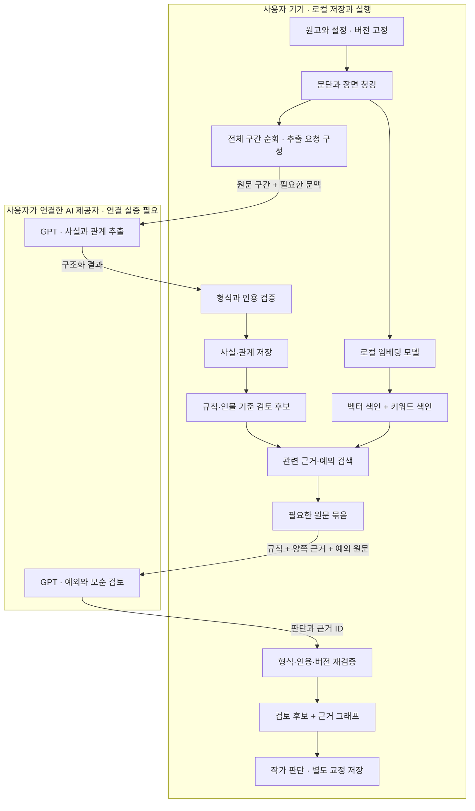

# Story Guard — 원고 분석 기술 흐름과 검증 계획

2026-09-09 · 최신 회의 결정 반영. 설계 제안이며 실제 AI·설치 성능 실증 전.

이 문서와 HTML은 같은 내용을 담습니다. 상세 계약과 측정 기록은 구현 시 별도로 버전 관리합니다.

## 먼저 확인할 기본 구성

**내장 AI는 임베딩 모델 1개입니다. 원고 벡터화와 검색 질의 벡터화에 같은 모델을 사용합니다.**

검색은 코드가 벡터를 비교하고 이름·별명으로 원문을 조회하는 작업입니다. 별도의 검색 모델이 필요한 것이 아닙니다. 외부 GPT는 실제 원문을 읽어 사실·관계 추출과 모순 검토를 담당합니다. 재순위 모델은 기본 구성에서 제외한 선택 사항입니다.

[용어 안내와 수정된 흐름도](story-guard-analysis-map.html#glossary)

## 회의 결정과 검증 목표

TECHNICAL PIPELINE · 팀 공통 설명
우리의 핵심 검증은 / 설치한 앱에서 끝까지 작동하는가.

공개 · 2주
소개 웹사이트
서비스 설명 · 작동 예시 · 다운로드 / 웹 서버에서 원고를 분석하지 않음

실제 제품
Mac · Windows 앱
로컬 원고 저장 · 로컬 임베딩 / 사용자 AI 연결로 분석

성공의 증거
같은 원고로 실증
설치 → 검색 → 실제 GPT 분석 / 원문 근거까지 양쪽 OS에서 확인

최신 회의 결정을 반영했습니다. 이전 자료의 웹 분석 체험판과 역할 배분은 이 결정으로 대체합니다.

## 전체 흐름도

TECHNICAL PIPELINE · 팀 공통 설명
원고는 로컬에서 정리하고, 필요한 원문으로 판단합니다.
01 · 로컬 코드
원고 가져오기
문서 버전 · 원문 위치 보존

02 · 로컬 모델
청킹 · 임베딩
장면 단위 분리 → 검색 색인

03 · 사용자 GPT
사실 · 관계 추출
모든 구간 순회 → 근거 있는 사실

04 · 검색 코드 + 같은 임베딩 모델
후보 · 근거 검색
관계·규칙으로 후보 생성 → 관련 원문

05 · 사용자 GPT
예외 · 모순 검토
규칙과 양쪽 장면을 함께 판단

06 · 로컬 코드 + 작가
근거 · 그래프 표시
출처 검증 → 검토 후보 → 작가 결정

원문·벡터·결과는 로컬 저장. GPT 호출 시 선택된 원문이 외부 전송됩니다. 벡터 자체를 GPT가 읽는 구조가 아닙니다.

## 두 번의 읽기

TECHNICAL PIPELINE · 팀 공통 설명
최초 추출과 검색 기반 검토는 다른 작업입니다.
1 · 전체 범위 읽기
사실을 수집
입력한 모든 구간을 순회. / 인물·행동·규칙·떡밥을 추출. / 처리한 범위와 실패 구간 기록.

2 · 관련 근거 읽기
후보를 검토
관련 장면·규칙·예외를 검색. / GPT에 원문 묶음을 전달. / 모순인지 설명 가능한지 검토.

3 · 변경 범위 읽기
수정 후 재분석
바뀐 구간과 주변 경계를 갱신. / 관련 인물·규칙의 영향도 추적. / 기존 작가 교정은 별도 보존.

RAG가 최초 전체 추출 비용까지 없애 주지는 않습니다.
최초 분석의 호출량은 원고 분량에 따라 늘어납니다. 재사용과 변경 분석으로 반복 호출을 줄입니다.

제안 구조 · 모델 품질과 성능은 실제 장비에서 검증 전입니다.

## 단계별 기술과 모델

TECHNICAL PIPELINE · 팀 공통 설명
모든 단계에 GPT가 필요한 것은 아닙니다.
가져오기 · 청킹
Python 파서 + 모델 토크나이저 / 생성 AI 불필요

벡터 생성 · 질의 변환
로컬 multilingual-e5-small 후보 / 동일 모델·전처리 사용

사실 추출 · 모순 검토
사용자가 연결한 제공자의 실제 사용 가능한 GPT 모델

검색 · 저장 · 표시
로컬 벡터 색인 + 키워드 검색 + SQLite + React / Cytoscape

단계 실행 · 재개
LangGraph + 로컬 체크포인트 / AI 모델이 아닌 실행 제어

Tauri 데스크톱 + Python 공통 엔진을 기본 경로로 검토합니다. 구독 연결로 사용 가능한 모델은 실증 후 고정합니다.

## 입력과 청킹

TECHNICAL PIPELINE · 팀 공통 설명
단어를 잘게 쪼개기보다, 근거가 남는 구간을 만듭니다.
입력 보존
원문과 위치
문서 ID · 버전 · 장/장면 ID / 인용문과 원문 위치 매핑 / 정규화 전후 위치 대응 보존

분할 기준
문단 · 장면 우선
320 / 480 토큰을 비교 실험 / 겹침 32~48 토큰부터 검토 / 모델 입력 한도 안에서 분할

설정 구분
사실의 지위
확정 설정 / 구상 메모 분리 / 원고 속 주장과 사실 구분 / 회상·소문·거짓말 표식 보존

청킹에는 임베딩 모델 추론이 필요하지 않습니다.
코드와 토크나이저로 구간을 만든 뒤, 임베딩 모델이 각 구간을 숫자 벡터로 변환합니다.

청킹 수치는 실험 시작값입니다. E5의 512 토큰 한도에는 접두사와 특수 토큰도 포함해 잘림을 방지합니다.

## 로컬 임베딩 후보

TECHNICAL PIPELINE · 팀 공통 설명
작은 다국어 모델부터 실제 원고로 비교합니다.
후보 · E5 small
한국어 검색 검증
multilingual-e5-small / 384차원 · 최대 512 토큰 / MIT · 한국어 포함 다국어

재현 조건
같은 입력 규칙
passage: 원고 / query: 질의 / 모델 지정 토크나이저·평균 풀링 / 벡터 정규화 · 모델 버전 고정

성능 비교
CPU 기준선 먼저
작은 배치로 메모리 측정 / 이후 ONNX·양자화 후보 비교 / 속도와 검색 품질을 함께 확인

임베딩 교체 시 기존 벡터를 그대로 섞지 않습니다.
모델·차원·전처리가 바뀌면 별도 색인으로 재구축합니다. 최초 다운로드와 이후 오프라인 실행을 구분합니다.

출처: intfloat/multilingual-e5-small 모델 카드. 후보 선정은 제안이며 한국어 소설 품질·장비 성능은 미측정입니다.

## GPT의 첫 역할 · 추출

TECHNICAL PIPELINE · 팀 공통 설명
관계 하나마다 “어디에 적혀 있는가”가 필요합니다.
관계의 내용
주어 · 관계 유형 · 대상 / 인물, 아이템, 사건, 규칙, 떡밥

해석의 조건
시점 · 긍정/부정 · 사실/주장/추측 · 화자 · 확정/구상

증거와 추적
문서 버전 · 구간 ID · 원문 위치 · 정확한 인용문 · 실행 ID

검증과 유보
형식 검증 + 인용 대조 / 별명 통합이 불확실하면 미확정

생성 결과가 곧 확정 세계관은 아닙니다.
원문에서 검증되지 않은 출처는 노출하지 않고 재검토 상태로 둡니다. 인용 일치만으로 해석의 정확성이 증명되지는 않습니다.

제안 구조 · 모델 품질과 성능은 실제 장비에서 검증 전입니다.

## RAG가 실제로 찾는 것

TECHNICAL PIPELINE · 팀 공통 설명
모순을 판단하려면 양쪽 장면과 예외가 필요합니다.
01화 · 규칙
계약자만 봉인검을 사용한다.

02화 · 선택
유나는 계약을 거절한다.

07화 · 행동
유나가 봉인검을 사용한다.

후보 생성 · 코드
같은 대상 묶기
유나 · 봉인검 · 계약 규칙 연결 / 무조건 모든 문장을 쌍으로 비교하지 않음

검색 · 로컬
근거 범위 넓히기
벡터 + 이름·별명 키워드 / 주변 장면 + 중간 계약·예외 탐색

검토 · GPT
원문 묶음 판단
규칙 + 두 장면 + 발견한 예외 / 모순 후보 / 설명 가능 / 정보 부족

검색되지 않았다는 사실은 원고 전체에 없다는 증거가 아닙니다. 검토 범위와 누락 가능성을 표시합니다.

## 검색 정확도와 속도

TECHNICAL PIPELINE · 팀 공통 설명
검색 후보 수는 비교 실험으로 정합니다.
검색 비교
키워드 / 벡터 / 결합
동일 질문·원고로 비교 / 별명·간접 표현·멀리 떨어진 근거 / 단순 방식보다 실제로 나아졌는지 확인

문맥 양 비교
상위 6 / 12개 후보
필수 규칙·양쪽 근거 우선 보존 / 중복 제거 · 주변 장면 제한 확장 / 문맥량·시간·누락을 함께 측정

추가 모델 도입
병목 확인 후
검색 누락 → 청킹·검색부터 개선 / 근거가 충분한 오판 → GPT 평가 / 재순위 모델은 필요가 입증되면 추가

벡터 유사도는 판단의 확신도나 정확도가 아닙니다.
“유사도 0.9 = 90% 정확”으로 표시하지 않습니다. 평가 원고의 정답 근거가 검색됐는지 측정합니다.

제안 구조 · 모델 품질과 성능은 실제 장비에서 검증 전입니다.

## 구독 연결 검증

TECHNICAL PIPELINE · 팀 공통 설명
로그인 성공 다음에, 실제 분석 호출을 확인합니다.
연결 실증
사용자 로그인 → 허용된 모델 확인 → 짧은 원문 실제 분석

기능 실증
구조화 응답 또는 파싱 검증 · 문맥 한도 · 오류 응답 확인

지속 사용
인증 갱신 · 로그아웃 · 한도 소진 · 취소 · 재개 확인

제품 동작
외부 전송 범위 안내 · 자격 증명은 OS 보안 저장소에 보관

팀 계정으로 자동 대체하지 않습니다.
연결 실패나 사용자 한도 소진 시 분석을 멈추고 이유를 표시합니다. 로컬 저장·검색·이미 생성한 결과는 유지합니다.

Hermes는 Codex 구독 연결의 참고 사례입니다. 우리 앱의 연동 가능성·허용 범위·사용 모델은 아직 실증 전이며 일반 API 권한과 동일시하지 않습니다.

## LangGraph의 역할

TECHNICAL PIPELINE · 팀 공통 설명
분석을 순서대로 실행하고, 실패 지점에서 복구합니다.
01 · 로컬
입력 준비
입력 버전 고정

02 · 로컬 모델
색인 갱신
변경 구간 캐시

03 · 사용자 GPT
사실 추출
구간별 완료 기록

04 · 로컬
후보 · 검색
검토할 근거 구성

05 · GPT + 코드
판단 · 검증
횟수 제한 재시도

06 · 로컬
저장 · 완료
버전 확인 후 반영

LangGraph 도입 자체가 정확도를 보장하지 않습니다. 체크포인트도 원고를 포함할 수 있으므로 로컬에 저장하고 로그 노출을 제한합니다.

## 속도와 호출량 관리

TECHNICAL PIPELINE · 팀 공통 설명
처음 분석, 수정 분석, 검색을 따로 측정합니다.
로컬 계산
한 번 계산해 재사용
모델 최초 로딩 / 이후 구분 / 구간 해시로 벡터 캐시 / 백그라운드 작업 · 작은 배치

GPT 호출
범위와 재시도 제한
추출·검토 프롬프트 버전 고정 / 제한된 병렬 호출 · 결과 재사용 / 실패·한도 소진 시 무한 재시도 금지

변경 영향
오래된 결과 방지
문서·모델·프롬프트 버전 추적 / 규칙 변경은 관련 결과 재검토 / 작가 수정은 별도 계층으로 보존

첫 실측 전에는 “전체 원고 10초” 같은 시간을 약속하지 않습니다.
검색 지연, GPT 대기, 전체 분석 시간, 최대 메모리를 분리해서 기록합니다. 취소와 진행률도 검증합니다.

제안 구조 · 모델 품질과 성능은 실제 장비에서 검증 전입니다.

## 품질 평가 기준

TECHNICAL PIPELINE · 팀 공통 설명
한 개의 정확도 숫자로 모든 단계를 숨기지 않습니다.
추출 품질
정답 사실·관계 중 찾은 비율 + 추출한 것 중 맞는 비율

검색 품질
Recall@k + 판단에 필요한 모든 근거를 함께 찾은 사례 비율

검토 품질
실제 문제를 찾은 비율 + 불필요한 경고 비율 / 작가 검토

출처 무결성
표시한 인용문은 해당 문서 버전과 100% 대조 통과

제안: 정답을 합의한 20~30개 사례 + 별도 미사용 평가 사례
명백한 모순, 예외가 있는 정상 사례, 별명·회상·소문, 미완결 떡밥을 포함합니다. 결과는 분자/분모와 함께 보고합니다.

100% 인용 대조는 출처 표시 조건이며 분석 정확도 목표가 아닙니다. 아직 실측 정확도나 성능 결과는 없습니다.

## 세 사람의 책임

TECHNICAL PIPELINE · 팀 공통 설명
Mac과 Windows는 같은 엔진을 검증합니다.
사용자 · macOS
Mac 실행과 배포
모델 실행 · 패키징 · 권한 / 인증 연동 · 안전한 저장 / 설치본으로 전체 경로 검증

팀원 · Windows
Windows 실행과 배포
모델 실행 · 패키징 · 경로 / 인증 연동 · 안전한 저장 / 동일 사례로 호환성 확인

팀원 · 웹 → 공통
소개 후 검증 지원
소개 웹 · 예시 · 다운로드 / 이후 공통 엔진·평가 자료 지원 / 공통 계약·변경 리뷰 조율

OS별 분석 엔진을 두 개 만들지 않습니다.
공통 코드·입출력 계약·평가 원고를 공유하고, 실행·설치·인증·경로 차이는 OS 어댑터에서 처리합니다.

공통 엔진 파일은 작업별 담당자를 지정합니다. OS 차이 때문에 의미가 달라지지 않는지 확인하되 GPT 응답의 글자 단위 동일성은 요구하지 않습니다.

## 먼저 할 세 가지 실험

TECHNICAL PIPELINE · 팀 공통 설명
화면 완성보다 먼저, 위험한 연결을 증명합니다.
실험 1 · 로컬
임베딩 → 검색
같은 원고로 Mac / Windows 비교 / 검색 근거 · 시간 · 메모리 기록 / 모델 다운로드 후 재실행 확인

실험 2 · 사용자 AI
로그인 → 실제 분석
연결 가능한 모델과 응답 확인 / 구조화 결과 · 만료·한도 처리 / 팀 계정 대체 없이 실행

실험 3 · 설치본
끝까지 한 사례
원고 → 추출 → 검색 → 검토 / 결과·원문 근거·그래프 열기 / 수정 후 재분석 · 취소 검증

통과 증거: 설치 파일 + 고정 원고 + 실행 기록 + 결과 화면
호출 수·시간·메모리·모델 버전과 실패 사례를 함께 남깁니다. 세 실험을 통과한 뒤 범위와 성능 목표를 확정합니다.

제안 구조 · 모델 품질과 성능은 실제 장비에서 검증 전입니다.

## 팀 공통 결론

TECHNICAL PIPELINE · 팀 공통 설명
우리가 검증할 것은 / “원고에 근거한 결과”입니다.

임베딩
검색할 벡터를 만든다
검색 코드가 벡터를 비교하고 원문을 조회 / 원문·벡터는 사용자의 기기에

GPT
원문을 읽고 해석한다
사용자가 연결한 AI로 추출·검토 / 실제 사용 모델과 권한은 확인 필요

코드와 작가
출처와 판단을 확인한다
코드는 형식·버전·인용 검증 / 작가는 설정과 수정 여부 결정

최신 결정 · 구현 제안 · 실측 결과를 구분해 공유합니다.
이 문서는 흐름과 검증 계획입니다. 앱 연동·모델 품질·양쪽 OS 성능이 입증됐다는 보고서는 아닙니다.

모델 카드·LangGraph·Hermes 참고 자료는 하단 “조사 근거”에 수록했습니다.

## 공식 자료
- [E5 모델 카드 · 입력 규칙과 제약](https://huggingface.co/intfloat/multilingual-e5-small/blob/main/README.md)
- [LangGraph · 체크포인트](https://docs.langchain.com/oss/python/langgraph/persistence)
- [Hermes · 제공자와 Codex 인증](https://github.com/NousResearch/hermes-agent/blob/main/website/docs/integrations/providers.md)
- [OpenAI · 임베딩 API 구분](https://developers.openai.com/api/docs/guides/embeddings)

## 구현 시 공유할 상세 계약 초안

다음은 구현 전에 팀이 확정할 초안이며 현재 코드에 적용된 계약이 아니다.

| 데이터 | 최소 필드와 의미 |
|---|---|
| DocumentVersion | 문서 ID, 내용 해시, 버전, 원문, 확정 설정/구상/원고 구분 |
| Chunk | 구간 ID, 문서 버전, 장면 ID, 원문 위치, 텍스트, 토큰 수, 분할기 버전 |
| EmbeddingRecord | 구간 ID, 모델 ID·리비전, 전처리 버전, 차원, 벡터 |
| Fact / Relation | 주어, 관계, 대상, 시점, 부정 여부, 주장 지위, 출처 목록, 미확정 여부 |
| EvidencePacket | 검토 후보, 필수 규칙, 양쪽 근거 원문, 예외 후보, 검색 범위, 입력 버전 |
| ReviewResult | 모순 후보/설명 가능/정보 부족, 설명, 근거 ID, 사용 모델, 프롬프트 버전 |
| AuthorOverlay | 작가의 확정·기각·교정, 연결 대상, 교정 버전, 근거 변경 시 재검토 상태 |
| Run | 실행 ID, 문서 스냅샷, 단계, 처리 구간, 실패 구간, 취소 상태, 사용량·시간 |

원문 위치는 Python과 JavaScript에서 같은 단위를 사용해야 한다. Unicode 코드 포인트 기준 등 하나를 합의하고 이모지·한글·줄바꿈 정규화 사례로 왕복 이동을 확인한다. 출처는 최신 문서에 임의 재연결하지 않고, 분석 당시 버전에 연결한다.

GPT의 구조화 출력 기능을 실제 연결 모델이 지원하면 활용한다. 지원하지 않으면 응답 파싱과 스키마 검증을 수행한다. 두 경로 모두 인용문을 코드로 대조하며, 복구 호출은 제한된 횟수만 허용한다. 인용이 누락됐다고 아무 원문 구간을 대신 붙이지 않는다.

## 데이터 흐름과 경계

임베딩은 원문을 대체하는 보안 변환이 아니다. 이 설계에서 원문과 벡터의 저장 위치는 로컬이지만, GPT 분석에는 원문 전송이 필요하다. 첫 전체 추출에서도 각 구간을 전송하므로 최초 분석 중에는 분석 대상 전체가 구간별로 외부 제공자에 전달될 수 있다. 앱에서 이 범위를 설명해야 한다.

## 정확도와 속도 실험 기록 양식

| 항목 | 기록 방법 |
|---|---|
| 환경 | OS, CPU, RAM, 앱 버전, 모델 리비전, 실행 백엔드 |
| 입력 | 문서·토큰 수, 구간 수, 최초 분석/한 장 수정/변경 없는 재실행 |
| 로컬 성능 | 최초 다운로드·로드 시간, 임베딩 처리량, 최대 메모리, 검색 지연 p50/p95 |
| 외부 분석 | 추출·검토별 호출 수, 전송 분량, 응답 시간, 실패·재시도·한도 소진 |
| 추출 | 사실·관계 정밀도와 재현율, 별명 오병합·누락 수 |
| 검색 | Recall@6/12와 필수 근거 전체 포함 사례 수/전체 사례 수 |
| 판단 | 정답 문제 중 발견한 수, 경고 중 실제 문제 수, 정보 부족 분류 |
| 사용자 흐름 | 취소 반응, 작업 재개, 원문 이동, 수정 후 오래된 결과 처리 |

초기 비교는 같은 평가 원고로 키워드 검색, 벡터 검색, 결합 검색을 실행한다. 다음에 청킹 320/480과 검색 후보 6/12를 비교한다. 모든 조합을 무한히 탐색하지 않고 실패 원인을 확인한 단계만 변경한다. 재순위 모델이나 더 큰 GPT를 추가하기 전에 해당 단계가 병목인지 확인한다.

속도 목표는 첫 양쪽 장비 측정 후 확정한다. 예를 들어 준비된 색인의 검색 p95 1초 이내를 초기 UX 목표로 검토할 수 있으나, 이는 달성된 성능도 전체 분석 시간 보장도 아니다. 최초 전체 분석 시간과 외부 AI 대기는 별도 표기한다.

평가용 원고는 합성 또는 사용 허락을 받은 자료로 만든다. 정답을 작성한 사람 외의 팀원이 사례를 교차 검토하고, 튜닝에 쓰지 않은 사례를 남겨 최종 평가한다. 20~30개 사례는 실패 유형을 찾기 위한 시작점이며 보편적 정확도를 추정하기에는 작다.

## 공유·재생성·검증

- 발표 파일: `story-guard-technical.html` — 폰트 내장, 인터넷 없이 열람 가능.
- 편집 원본: `source/technical-slides.html`.
- 재생성: `python3 docs/presentation/source/build-technical.py`.
- PDF: `output/playwright/technical/story-guard-technical.pdf` (저장소 루트 기준).
- 화면 검증: 16장 × 3개 뷰포트, 가로 넘침·본문 잘림 검사 통과. 키보드·목차·근거 창·전체 화면·인쇄 확인. 외부 리소스 요청 및 JavaScript 오류 0건.
- 이 검증은 발표 자료에 대한 것이다. 앱의 임베딩 성능·GPT 연결·분석 정확도는 이번 작업에서 실행하지 않았다.

## 용어 사전

| 용어 | 분류 | 역할 | 오해 방지 |
|---|---|---|---|
| 청킹 | 일반 코드 | 원고를 장면·문단 등의 구간으로 나눕니다. | 청킹 자체가 AI 추론이나 단어·인물 추출은 아닙니다. |
| 토크나이저 | 모델에 맞는 처리 도구 | 텍스트를 모델 입력 단위인 토큰으로 바꾸고 길이를 셉니다. | 별도의 분석 AI가 아닙니다. 토큰은 단어·글자와 일대일 대응하지 않습니다. |
| 임베딩 모델 | 필수 로컬 AI · 1개 | 원고와 검색 질의를 같은 벡터 공간의 숫자 배열로 바꿉니다. | 원고용·검색용 모델을 따로 설치하지 않습니다. 모델은 같아도 입력 접두사 등은 다를 수 있습니다. |
| 벡터 | 데이터 | 내용을 비교하기 위해 모델이 만든 숫자 배열입니다. | 원문을 대신 읽는 요약문도, 인물·관계 목록도 아닙니다. |
| 색인·벡터 저장소 | 저장·검색 소프트웨어 | 벡터와 원문 구간 ID를 저장하고 빠르게 찾도록 정리합니다. | DB는 AI 모델이 아닙니다. 원문과 벡터의 연결이 필요합니다. |
| 검색 질의 | 입력 데이터 | 찾을 내용입니다. 예: “유나의 계약 체결이나 봉인검 사용 예외”. | 사용자가 직접 질문하지 않아도 검토 후보에서 코드가 구성할 수 있습니다. |
| 로컬 검색·결합 검색 | 일반 코드 + 같은 임베딩 모델 | 질의를 벡터화한 뒤 유사도를 비교하고, 이름·별명 검색을 함께 사용합니다. | 검색 전용 AI를 하나 더 설치한다는 뜻이 아닙니다. 임베딩만으로 모든 근거가 찾아지지는 않습니다. |
| RAG | 처리 방식 | 관련 자료를 검색해 원문을 GPT 입력에 넣고 그 근거로 답하게 합니다. | 모델 이름이나 DB 이름이 아닙니다. RAG를 사용해도 오판·누락은 생길 수 있습니다. |
| GPT·생성 모델 | 외부 AI · 사용자 연결 | 원문에서 사실·관계를 추출하고 근거 묶음으로 모순 후보를 검토합니다. | 이 설계에서는 로컬 내장 모델이 아닙니다. 구독 연결의 실제 지원 범위는 검증이 필요합니다. |
| 재순위 모델·reranker | 선택 AI · 기본 구성 제외 | 이미 검색한 원문 후보를 다시 점수 매겨 순서를 조정합니다. | 필수 검색 모델이 아닙니다. 후보에 아예 없는 근거를 되찾아 주지는 못합니다. |
| LangGraph | 실행 제어 라이브러리 | 분석 단계와 상태, 분기, 실패 복구를 연결하도록 구현하는 도구입니다. | AI 모델도, 작가에게 보여 주는 인물 관계 그래프도 아닙니다. |
| 관계 그래프 | 결과 데이터 + 화면 | 인물·아이템 등을 점으로, 근거 있는 관계를 선으로 표시합니다. | 임베딩 벡터를 바로 그림으로 만든 것이 아닙니다. 추출 결과와 원문 근거를 사용합니다. |
