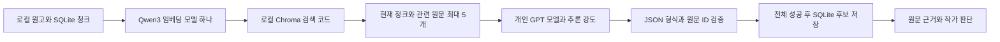

# 개인 GPT 계정으로 원고 분석: 구현과 실검증

2026-09-10. 로컬 개발 환경에서 검증했으며 Windows 패키지 배포 검증은 포함하지 않는다.

## 사용 흐름

작품 선택 → 원고 추가 → ChatGPT 연결 → 사용 가능한 모델 및 추론 강도 선택 → 원문 전송 동의 → **이 작품 GPT 분석** → 설정 붕괴 리포트에서 원문 근거와 함께 검토 → 작가가 확정·무시·보류.

현재 GPT 버튼은 선택한 작품 전체를 검토한다. 기존 회차 범위 컨트롤은 GPT 전송 범위를 제한하지 않는다. 연결 검증용 가상 원고 동의와 실제 작품 전송 동의는 별개이며, 작품 변경 시 작품 동의가 초기화된다.

검색은 별도 AI 모델이 아니다. 각 청크를 한 번씩 검토하며 청크마다 현재 원문과 검색 결과를 GPT에 전송한다. 요청 수는 청크 수에 비례한다. 팀 API 키로 우회하지 않는다. GPT 생성 모델을 사용하므로 이 경로에는 로컬 생성 모델 설치가 필요 없다.

## 실측 결과

실제 Qwen3-Embedding-0.6B-Q8_0.gguf + Chroma + 연결된 계정의 GPT-5.6-Sol / Low를 사용했다. 서로 다른 두 작품에 각각 짧은 원고 2편을 저장했다. 각 작품은 GPT 요청 2회이며, 시간에는 검색과 모델 응답, 저장이 포함된다.

| 사례 | 결과 | 시간 |
|---|---|---|
| 예외 없이 계약자만 검 사용 가능, 유나는 계약하지 않은 채 사용 | 충돌 후보 1개, 실제 원문 ID 1·2 저장 | 17.70초 |
| 같은 규칙, 유나가 정식 계약을 맺은 후 검 사용 | 충돌 후보 0개 | 9.63초 |

실측 기록: `output/validation/gpt-live/results.json`. UI에서도 충돌 사례의 제목, 설명, 두 원문과 작가 판단 버튼을 확인했다. 임베딩 파일은 기존 다운로드 파일을 하드링크하여 약 639MB를 추가 복사하지 않았다.

## 보존 및 검증

- GPT 출력 JSON과 제공된 근거 ID를 검증한다. 유효한 ID가 있다는 사실만으로 판단 내용의 정확성이 보장되지는 않는다.
- 모든 청크 요청 성공 후 하나의 DB 트랜잭션으로 미검토 후보를 교체한다. 기존 관계 지도 및 작가가 확정·무시·보류한 판단은 유지한다.
- 실패, 취소, 분석 도중 원고 변경 시 이번 결과를 저장하지 않는다. 취소를 반복해도 이전 결과를 지우지 않는다.
- 테스트: 근거 없는 출력 거부, 취소·실패 시 결과 보존, 원고 변경 감지, 작가 판단 유지, 전송 동의, 모델·추론 강도 전달.

## 아직 검증하거나 개선할 부분

- 위 두 사례는 동작 확인이며 장편 소설 정확도 평가가 아니다. 검색 상위 4개에 중요한 예외가 빠질 수 있다.
- 동일 근거 ID 묶음의 후보를 합치므로 같은 원문에 여러 독립 문제가 있으면 합쳐질 수 있다.
- 이번 GPT 경로는 설정 충돌 후보를 생성한다. 인물·관계 지도와 떡밥 추출은 아직 기존 로컬 분석 경로이다.
- 긴 작품은 청크 수만큼 GPT 요청을 사용한다. 실행 전 예상 요청 수 표시, 부분 재분석 및 재개 기능이 후속 과제다.
- 요청당 90초 제한이 있다. 높은 추론 강도는 시간 제한에 걸릴 수 있으며 실패 시 기존 후보는 유지된다.
- 개발 환경은 설치된 Codex app-server 실행 파일을 이용한다. 배포 앱의 런타임 포함 방식과 Windows에서 같은 흐름의 검증은 별도 작업이다.
